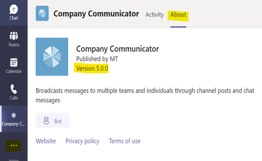

## Known Limitations
### 1. Author/publishing experience is not supported on Mobile

The tab where authors/creators of messages create a message is not supported on mobile. The recommended approach is to create the messages on the desktop only.

## FAQs

### 1. Are messages sent to guest users?
No. Guest users are excluded from receiving messages. They will still be able to view messages posted to a channel.

### 2. Does Company Communicator respond with a message to users who ask a question or reply to a message?
No, by default the bot only sends messages and does not respond with a message. The bot can be customized to reply with a custom message or connected to a knowledge base to respond with answers from the knowledge base.

### 3. Is it mandatory to choose multi-tenant account types while app registration?
Yes. The User bot registration must be **multi-tenant** so the bot can run cross-tenant proactive flows; the Author bot can be single-tenant if you only need it inside your install tenant. The modernized template defaults to MultiTenant for the User bot and SingleTenant for the Author + Graph bots; `deploy.ps1` configures this for you. See [Azure Bot supported account types](https://learn.microsoft.com/azure/bot-service/bot-service-quickstart-registration) for background.

| Type | Description |
|--|--|
| Accounts in any organizational directory (Any Azure AD - Multitenant) | This option provides less exposure by restricting access and in case OAuth is not supported. |
| Accounts in any organizational directory (Any Azure AD - Multitenant) and personal Microsoft accounts (for example, Xbox, Outlook.com) | This option is well-suited to support OAuth and bot authentication. |

### 4. How to clone the GitHub repository?
Please follow this [link](https://docs.github.com/en/github/creating-cloning-and-archiving-repositories/cloning-a-repository) for detailed instructions on cloning GitHub repository to create a local copy on your computer and sync between the two locations.

### 5. Can I change the App Service Plan SKU after deployment?
The modernized template locks the plan to **Premium V3** (`P0v3` or `P1v3`) so that the in-process .NET 8 isolated functions and the bot site have enough memory and always-on capacity. You can switch between `P0v3` (4 GB / ~1 vCPU) and `P1v3` (8 GB / 2 vCPU) at any time from the App Service Plan blade without re-running the deploy script. Going below Premium V3 is **not supported**: Basic / Standard SKUs do not provide enough memory headroom for the warm in-process worker.

### 6. When I export the results of a sent message the author bot on the desktop client shows "Go back to the main window to see this content". 
 
 
 The issue seems specific to your Teams setup and not related to the Company Communicator app. 

### 7. I'm sending messages every week to more than 100k users, does CC support this volume? 
The modernized v5.x line targets ~2 million messages per send on `P1v3` based on architectural capacity (separate storage account per function app, Service Bus Basic, the throttle-aware send pipeline). This figure has **not been validated end-to-end** on the modernized fork — only sandbox-volume smoke tests have been run. Earlier (4.1.x) numbers in the wild were on the order of 100k. If you plan to send at this scale, expect to tune `serviceBus.messageHandlerOptions.maxConcurrentCalls` in the send function's `host.json` (default `30`) and validate against your own Service Bus, Storage, and Bot Framework throttling limits.

### 8. Is it possible to use Linux over Windows in App service plan? 
The template targets **Windows** Premium V3. Switching to Linux requires editing the ARM template (`Deployment/azuredeploy.json`) and is not validated by the modernization fork — expect to debug at minimum the `.NET 8 isolated` worker hosting model and the source-control sync that pushes the pre-built `ClientApp/build/` artifact.

### 9. How do I know the version of the app? 

### 10. After deployment I see a `NetworkWatcherRG` resource group in my subscription. Where did it come from?
This resource group is **not created by the Company Communicator deployment script**. It is auto-provisioned by the Azure platform the first time any networking resource (VNet, NIC, Private Endpoint, etc.) is deployed in a given region in your subscription. Because the modernized template provisions a VNet and Private Endpoints, Azure creates `NetworkWatcherRG` (and a `Microsoft.Network/networkWatchers` instance per region) automatically.

Key points:
- It is a **subscription-wide, platform-managed** resource group, shared across all VNet workloads in the subscription.
- It will **not** be deleted when you delete the Company Communicator resource group.
- Deleting it manually is not recommended — Azure will recreate it on the next networking deployment, and you will lose any Network Watcher data (flow logs, connection monitors, etc.).
- If your organization disallows the auto-provisioning, register the `Microsoft.Network/AllowNetworkWatcher` feature with the appropriate setting at the subscription level.

  
