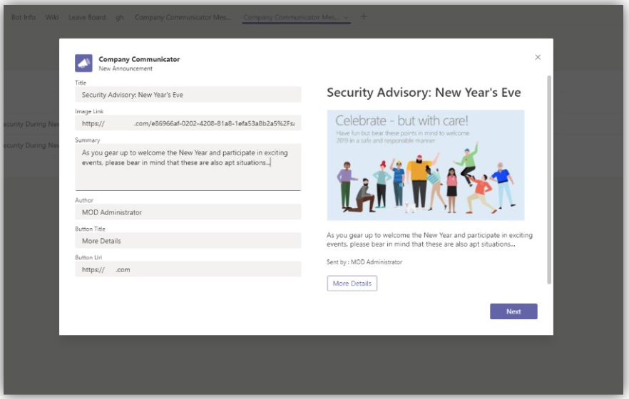

# Company Communicator (Modernized fork)

Company Communicator is a custom Teams app that enables corporate teams to create and send messages intended for multiple teams or large number of employees over chat allowing organization to reach employees right where they collaborate. Utilize this template for multiple scenarios such as new initiative announcements, employee onboarding, modern learning and development or organization-wide broadcasts.

The app provides an easy interface for designated users to create, preview, collaborate and send messages.

It provides a foundation to build custom targeted communication capabilities such as custom telemetry on how many users acknowledged or interacted with a message.

> This wiki documents the **modernized v5.x fork** maintained at [rutrac/microsoft-teams-apps-company-communicator-modernized](https://github.com/rutrac/microsoft-teams-apps-company-communicator-modernized). It runs on .NET 8 isolated Azure Functions, ASP.NET Core 8, React 18 + Vite + Fluent UI Northstar, behind Azure Front Door Standard with VNet + Private Endpoints. Legacy upgrade paths from v4.x / pre-v5.27 deployments are **no longer supported** — deploy fresh into a clean resource group.

* [Solution overview](Solution-overview)
    * [Data stores](Data-stores)
    * [Cost estimate](Cost-estimate)
    * [Known limitations](Known-limitations)
    * [Localization](Localization)
    * [Telemetry](Telemetry)
* Deploying the app
    * [Deployment guide (PowerShell, recommended)](Deployment-guide-powershell)
    * [Deployment guide (manual portal)](Deployment-guide)
    * [Custom domain option](Custom-domain-option)
    * [Troubleshooting (PowerShell)](Troubleshooting-powershell-script)
    * [Troubleshooting (manual)](Troubleshooting)
    * [FAQ](FAQ)
* [Release Notes](Release-notes)